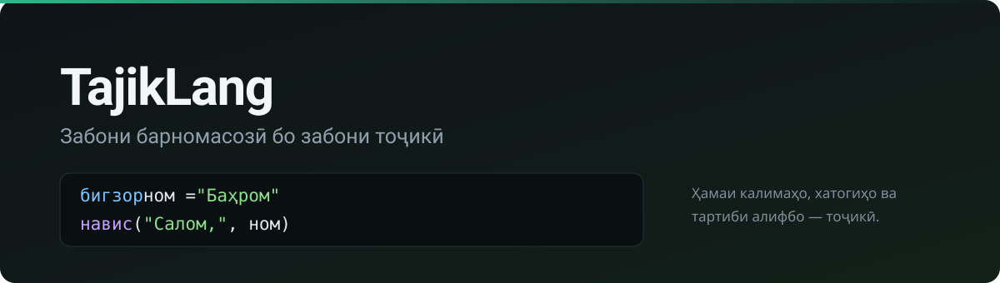

<div align="center">



<br>

**A programming language whose keywords, error messages and alphabet ordering are Tajik.**

[**▶ Try it in your browser**](https://tajiklang.netlify.app/playground.html) &nbsp;·&nbsp;
[**Website**](https://tajiklang.netlify.app) &nbsp;·&nbsp;
[**⬇ Download**](https://tajiklang.netlify.app/download) &nbsp;·&nbsp;
[**Дарсҳо — 13 lessons**](docs/дарсҳо.md) &nbsp;·&nbsp;
[**Тоҷикӣ**](README.tg.md)

[](https://github.com/BahromPython/tajiklang/actions/workflows/tests.yml)
[](https://tajiklang.netlify.app)


[](LICENSE)

</div>

---

> Making programming education accessible to Tajik-speaking students by letting
> beginners learn programming concepts in their own language.

```tajik
қолиб Донишҷӯ:
    функсия оғоз(худ, ном, баҳо):
        худ.ном = ном
        худ.баҳо = баҳо

    функсия хулоса(худ):
        агар худ.баҳо >= 4.5:
            баргардон "аъло"
        баргардон "хуб"

бигзор синф = [
    Донишҷӯ("Яқубов", 4.75),
    Донишҷӯ("Ғафуров", 3.5),
]

функсия номи(д):
    баргардон д.ном

барои д аз тартиб_бо(синф, номи):
    навис(д.ном, "—", д.хулоса())
```

Not one English word — not in the program, not in the errors.

---

## Three things Python cannot do

### 1 · It checks your program before running it

Python finds a misspelled name only when that line executes, so a typo in a
branch that runs once a month ships to production. TajikLang reports
**everything it is certain of, before any output appears**:

```
Хатои санҷиш (CheckError) (сатри 3, сутуни 11):

        навис(нмо)
              ^

Номи "нмо" муайян нашудааст.
Маслиҳат: Оё шумо "ном" -ро дар назар доштед?

Ҳамагӣ 2 хато. Барнома иҷро нашуд.
```

The rule it lives by is **no false alarms** — it mirrors the interpreter's
scope rules exactly and stays silent about anything it cannot be sure of.

### 2 · Decimal arithmetic

| | `0.1 + 0.2` | `== 0.3` |
|---|---|---|
| Python, C, Java, JavaScript | `0.30000000000000004` | `false` |
| **TajikLang** | **`0.3`** | **`рост`** |

School arithmetic is decimal. Money is decimal. Marks are decimal. Binary
floating point is a machine detail that does not belong in lesson 3.

### 3 · `чаро` — the question no other language answers

```tajik
бигзор ҷамъ = 0
барои i аз 1 то 3:
    ҷамъ += i
чаро(ҷамъ)
```
```
Тағйирёбандаи "ҷамъ":
    сатри 1    →  0    (эълон)
    сатри 3    →  1    (ивазкунӣ)
    сатри 3    →  3    (ивазкунӣ)
    сатри 3    →  6    (ивазкунӣ)
```

*"Why does my variable hold that?"* is the commonest beginner question, and
every mainstream language answers it with silence.

---

## Tajik, not translated

|  |  |
|---|---|
| **Alphabet order** | `ғ ӣ қ ӯ ҳ ҷ` sit after `я` in Unicode, so every other language sorts a Tajik class list wrongly. Here `Ғафуров` comes before `Яқубов` — in `<` and in `тартиб`. |
| **Unicode normalisation** | `ӣ` has two spellings that look identical on screen. Without normalising, the same name typed on two keyboards is two different variables. |
| **No truthiness** | `агар ном:` is an error. Write `агар ном != "":` and say what you mean. |
| **Errors teach** | Line, column, a caret, a suggested fix, and the chain of calls that led there — plus the English term in brackets (`Хатои иҷро (RuntimeError)`) so the vocabulary transfers. |

---

## It compiles itself

A language that only exists as somebody else's program is a wrapper. TajikLang
is not one: [`худсоз/`](худсоз/) holds a TajikLang compiler **written in
TajikLang**, which reads `.tj` files and emits JavaScript.

```
насли 0    the reference implementation compiles the compiler   → .js
насли 1    node runs that .js on the same sources               → .js
насли 2    node runs *that* .js on the same sources             → .js
```

Two properties are tested on every run, and they check different things:

* **насли 1 == насли 2** — the compiler is a fixed point. A bug that changed
  its own output would make the second pass drift from the first.
* **насли 0 == насли 1** — two implementations, one in Python and one in
  JavaScript, produce byte-identical output. The program under test is the
  compiler itself, so any disagreement between them shows up as a diff.

It has already earned its keep. The Tajik-written lexer did not know the `\r`
escape and turned it into a plain `r`, which quietly made the letter **r** a
separator — `ба_javascript` lexed as `ба_javasc` and `ipt`. No ordinary test
would have caught that; the fixpoint test caught it on the first pass.

The exact-decimal arithmetic, the ban on truthiness and the Tajik alphabet
order all survive the trip: `0.1 + 0.2 == 0.3` is `рост` under Node too, and
`тартиб` still puts `ғоз` after `гул`. See [`худсоз/README.md`](худсоз/README.md)
for what the self-hosted compiler supports so far, and what it does not.

```powershell
powershell -File худсоз\санҷиши_худсозӣ.ps1
```

---

## Install

<table>
<tr>
<td width="33%" valign="top">

### Nothing at all

[**Open the playground →**](https://tajiklang.netlify.app/playground.html)

Runs in one page. No install, no account.

</td>
<td width="33%" valign="top">

### Windows — no Python

[**Download →**](https://tajiklang.netlify.app/download)

```powershell
powershell -ExecutionPolicy Bypass -File насб.ps1
```

Adds `tajik` to PATH, opens `.tj` files on double-click, and puts the editor
in the Start menu.

</td>
<td width="33%" valign="top">

### With Python

```bash
pip install git+https://github.com/BahromPython/tajiklang.git
```

</td>
</tr>
</table>

```bash
tajik барнома.tj        # run a file
tajik                   # interactive shell
tajik муҳаррир          # the editor
tajik --санҷиш f.tj     # check without running
tajik --tokens f.tj     # look inside the lexer
```

### Бастаҳо · Packages

TajikLang has **its own package manager**, not pip — a student installing a
Tajik library should not have to learn Python's tooling first, and the
standalone build has no pip at all.

```bash
tajik ҷустуҷӯ           # what exists
tajik гирифтан омор     # install it
tajik бастаҳо           # what is installed
tajik нест омор         # remove it
```

```tajik
ворид омор
ворид шакл

бигзор баҳоҳо = [5, 4, 5, 3, 5, 4, 2]

шакл.қуттӣ("Журнали синф")
навис("Медиана:", омор.медиана(баҳоҳо))
навис("Инҳироф:", гирд(омор.инҳироф(баҳоҳо), 2))
шакл.диаграмма(["Душанбе", "Хуҷанд"], [95, 60])
```

A package is a folder of `.tj` files; the registry is one JSON file, read from
GitHub when there is a network and from the bundled copy when there is not, so
a classroom offline still gets a working `ҷустуҷӯ`. Installing only ever writes
`.tj` files, and every path in the archive is checked first — a zip claiming
`../../evil.tj` cannot write outside its own folder.

Both starter packages — `омор` (median, mode, variance) and `шакл` (boxes,
bar charts) — are **written in TajikLang**, not Python.

### TajikWeb · Сомонасозӣ

Build a real static website with TajikLang — then host the resulting normal
HTML anywhere. The first version deliberately has no framework, no JavaScript
toolchain, and no account requirement.

```bash
tajik веб нав сомонаи_ман
cd сомонаи_ман
tajik веб соз
```

Write the page in `index.tj` with the Tajik `саҳифа` module. The ready-to-host
site is `нашр/index.html`; files placed in `static/` are copied there too.

```tajik
ворид саҳифа

саҳифа.нависед(
    саҳифа.сарлавҳа("Сомонаи ман"),
    саҳифа.матн("Салом аз Тоҷикистон!"),
    саҳифа.рӯйхат(["Барнома", "Лоиҳаҳо", "Тамос"]),
)
```

To publish from a GitHub repository, add a ready-made Pages workflow:

```bash
tajik веб омода-github
```

Push the project and select **GitHub Actions** under the repository's
**Settings → Pages**. Each later push rebuilds and publishes the site. See
[docs/веб.md](docs/веб.md) for the small, complete guide.

### The editor

```bash
py -m tajiklang.ide
```

A small IDE on tkinter, which ships with Python — a school computer needs
nothing else. File list, Tajik syntax colouring, line numbers, an input pane
for `хонед`, **F5** to run, **F6** to check. The problems panel lists what the
checker found *before* the program runs; click a problem to jump to its line.

### VS Code

```bash
py tools/build_vsix.py
code --install-extension dist/tajiklang-2.0.0.vsix
```

Syntax highlighting, 4-space indentation enforced (the language rejects tabs),
and **Ctrl+Shift+B** to run the open file. `build_vsix.py` packages the
extension with the standard library alone — no `npm`, no `vsce`, no network,
because *"install Node.js first"* is a poor answer for a school in Dushanbe.

---

## Learn it

| | |
|---|---|
| [**docs/дарсҳо.md**](docs/дарсҳо.md) | **13 lessons in Tajik** — `навис` through classes and web pages |
| [docs/чӣ_тавр_кор_мекунад.md](docs/чӣ_тавр_кор_мекунад.md) | how the interpreter works, in Tajik |
| [LANGUAGE_SPEC.md](LANGUAGE_SPEC.md) | the language contract, with the reasoning behind every decision |
| [examples/](examples/) | 24 runnable programs |

<details>
<summary><b>The whole language on one screen</b></summary>

<br>

```tajik
бигзор ном = "Баҳром"          # declare
ном = "Далер"                  # assign — a different statement, on purpose
ҳисоб += 1                     # += -= *= /= %=

агар синну_сол >= 18:          # blocks are exactly 4 spaces; tabs refused
    навис("калонсол")
вагарна агар синну_сол >= 16:
    навис("наврас")
вагарна:
    навис("хурд")

барои i аз 1 то 5:             # inclusive: 1, 2, 3, 4, 5
    агар i % 2 == 0:
        давом
    навис(i)

то_вақте ҳисоб < 10:
    ҳисоб += 1
    агар ҳисоб == 5:
        шикан

функсия ҷамъ(a, b):
    баргардон a + b

қолиб Одам:
    функсия оғоз(худ, ном):
        худ.ном = ном

қолиб Донишҷӯ мерос Одам:
    функсия салом(худ):
        баргардон "Салом, " + худ.ном

кӯшиш:
    навис(1 / 0)
хато "тақсим_ба_сифр":
    навис("сифр нашавад")
хато паём:
    навис("хатои дигар:", паём)

номҳо |> тартиб |> навис       # pipeline: Tajik puts the verb last

ворид риёзӣ                    # риёзӣ · матн · файл · саҳифа · питон
ворид питон                    # Python's libraries, through one door
```

**Why `қолиб` and not `синф`?** Because `бигзор синф = 10` belongs on the first
line of a school register program. `қолиб` means *mould* — which is also the
metaphor for what a class is. The same reasoning left `худ` unreserved: Python
does not reserve `self` either.

</details>

<details>
<summary><b>Architecture</b></summary>

<br>

```
Source (.tj, UTF-8)
      ↓  lexer.py         characters → tokens, NFC, INDENT/DEDENT
   Tokens
      ↓  parser.py        recursive descent, one method per grammar rule
   AST
      ↓  checker.py       every problem, before anything runs
      ↓  interpreter.py   tree-walk evaluator
   Output
```

| File | Job |
|---|---|
| `tajiklang/tokens.py` | token types, the reserved Tajik vocabulary |
| `tajiklang/lexer.py` | text → tokens; NFC; Unicode identifiers; indentation |
| `tajiklang/parser.py` | recursive-descent parser |
| `tajiklang/checker.py` | the pre-run pass Python cannot do |
| `tajiklang/interpreter.py` | scopes, closures, classes, calls, imports |
| `tajiklang/values.py` | runtime values, Tajik type names, printing, equality |
| `tajiklang/stdlib.py` | 56 built-in functions, plus `риёзӣ` and `матн` |
| `tajiklang/collation.py` | Tajik alphabet order |
| `tajiklang/page.py` | `саҳифа` — building web pages |
| `tajiklang/web.py` | `TajikWeb` — create and build static TajikLang sites |
| `tajiklang/interop.py` | `питон` — the one door to Python's libraries |
| `tajiklang/ide.py` | the tkinter editor |
| `tajiklang/highlight.py` | one definition of syntax colours, shared by the editor and the site |
| `tajiklang/packages.py` | `бастаҳо` — the package manager |
| `tajiklang/errors.py` | Tajik errors with caret, hint and call stack |
| `tools/` | builders for the playground, site, `.vsix`, standalone build and review sheet |
| `бастаҳо/` | the package registry, and two packages written in TajikLang |

```bash
python -m unittest discover -s tests -t .
```

</details>

---

## For teachers · Барои муаллимон

[**docs/ТАРҶУМА.md**](docs/ТАРҶУМА.md) lists **every one of the 588 Tajik
messages** the language can show a student, with a column for a better
wording. It is generated from source, so it cannot drift from what the
language actually says.

If you read Tajik and have twenty minutes, that file is the most valuable
contribution anyone can make to this project — worth more than any feature.
The author is not a Tajik speaker.

---

## Contributing

Tests must stay green (`python -m unittest discover -s tests -t .`), and
generated files — `playground/`, `docs/ТАРҶУМА.md` — are rebuilt by their
tools rather than edited by hand. CI checks both.

## Roadmap

The self-hosted compiler in [`худсоз/`](худсоз/) covers the subset it needed to
compile itself. Classes, `кӯшиш`/`хато`, the `|>` operator and the standard
modules are still reference-implementation only; extending it is the next piece
of real work, and finishing it would let the playground drop its 6 MB CPython
download for a few kilobytes of JavaScript.

Everything else planned is built. What remains is not code: a Tajik teacher
reading `ТАРҶУМА.md`, and students using it.

<div align="center">
<br>
<sub>MIT · <a href="https://tajiklang.netlify.app">tajiklang.netlify.app</a></sub>
</div>
